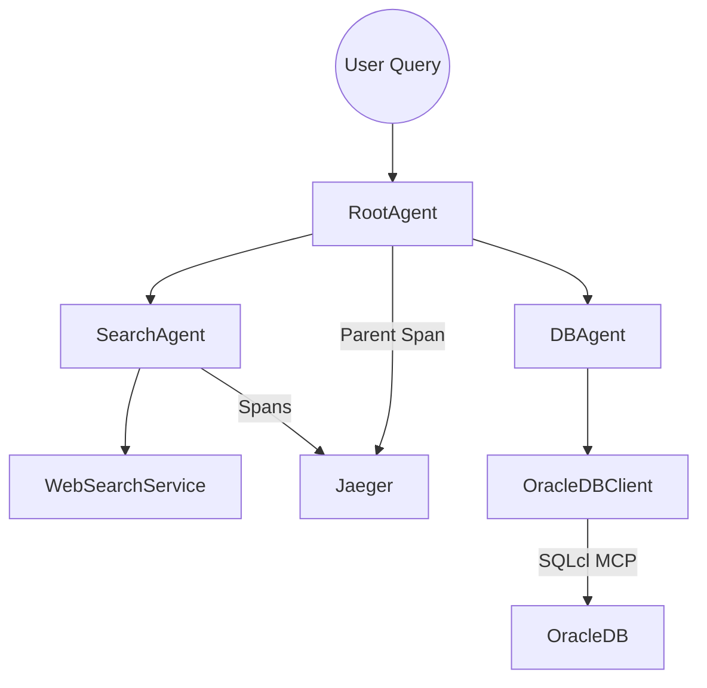

# Agentic Research Analyst Demo

A teaching-oriented demo that showcases a multi-agent research workflow with full observability. The application coordinates web-search and Oracle database agents, instruments spans with OpenTelemetry, and exports traces to Jaeger for visualization.

## Prerequisites
- Python 3.11+
- Docker Desktop (for Jaeger)
- Make (optional, for future scripts)

## Installation
```bash
python -m venv .venv
source .venv/bin/activate
pip install -r requirements.txt
```

## Environment Variables
Copy the template and update secrets:
```bash
cp .env.example .env
# Edit .env with your keys
```

## Running Jaeger
```bash
cd docker
docker compose up jaeger
# UI available at http://localhost:16686
```

## Running the Application
```bash
python src/app.py
```
> Logic is not implemented yet—this will serve as the main entry point.

## Viewing Traces
1. Start the Python app (once spans are emitted).
2. Open http://localhost:16686 in a browser.
3. Select the service created by the app and explore traces.

## Architecture (High-Level)

